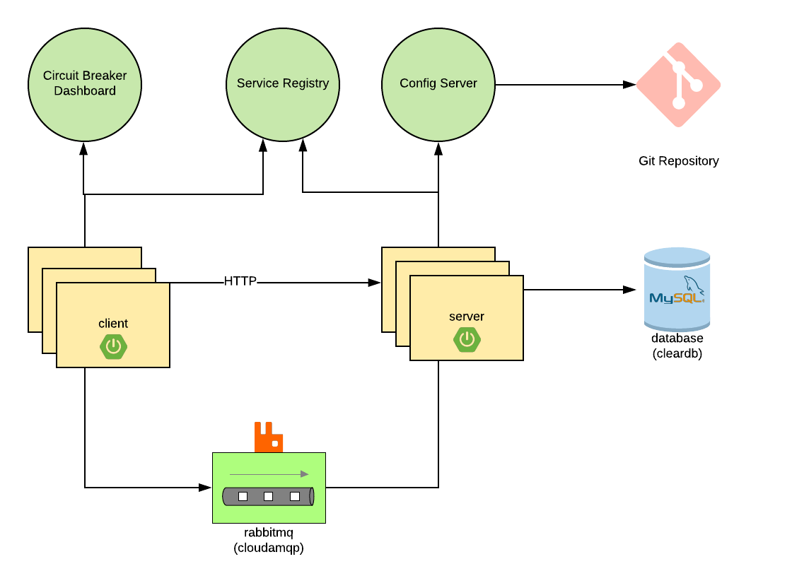

# jlr-spring-demo
Adhoc Demo's from Cloud Native Workshop.


Here is two web spring boot applications:
1. Server
   * This microservice is attached to the following backing services:
     * A Relational database to store quotes in
     * A RabbitMQ service to receive streams of new Quotes to create in the relational database
     * A Service Registry (Eureka) that it can register itself with (see ```spring.application.name``` ) so that clients can know where to send load balanced https requests to in order to create quotes.
     * A Git backed config server that allows us to read a value for the property ```my.property```
   
2. Client
   * This microservice is attached to the following backing services:
     * A Service Registry (Eureka) so that it can lookup where to send loadbalanced https requests to the server in order to save quotes
     * A RabbitMQ service to send messages to a message channel that is consumed by the server (this also allows quotes to be persisted in the database)
     * A Circuit Breaker that has a fallback incase there are issues with out downstream server

The Client application contains 3 endpoints:     
* ``` /quoteHTTP``` a POST handler for saving a quote. Client communicates with Server via HTTPS, using a @Loadbalanced RestTemplate.
* ``` /quoteQuoteMessaging``` a POST handler for saving a quote. Client communicates with Server via a message channel.
* ``` /quotes``` a GET handler for retrieving all quotes saved in the system.

### Running these examples on PCF:
Firstly create the following services
```cf create-service p-service-registry standard service-registry``` 